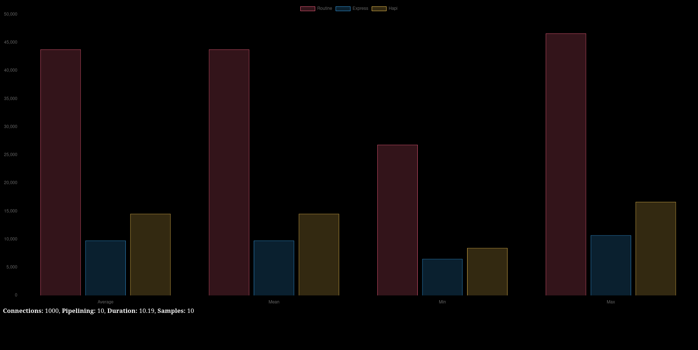

Benchmarks are present inside the `benchmarks` directory
To run, make sure you have `Nodejs > 18` installed as well as `npm`

Run `npm install` inside `benchmarks` directory,
afterwards, run the `run.sh` shell file to execute benchmarking process

Here are is a pretty graph

`Express` on average accepts `9,300` reqs/second, while
`Routine` handles `43,800` reqs/second